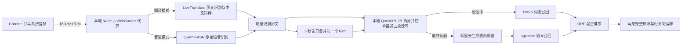

# Interview Knowledge Radar

Interview Knowledge Radar 是本地优先的实时面试辅助工具。Chrome 只采集用户主动共享的系统音频；翻译模式通过阿里云实时翻译输出英文原文与中文同传，普通模式通过独立实时 ASR 只输出原始转写。本地 Qwen3.5-2B 会把一轮语音拆成独立问题，并用最近的面试上下文补全“这个项目”“你的职责”等追问；每题再用 PostgreSQL 中的 BM25 和 pgvector 召回最多两条完整知识。

## 核心能力

- **翻译/普通双模式**：翻译模式调用 LiveTranslate，普通模式只调用 Qwen3-ASR-Realtime，不产生翻译请求。
- **系统音频采集**：只使用 Chrome 屏幕/窗口/标签页共享，不请求麦克风。
- **5 秒问题合并**：连续 ASR 片段合并为一条面试官问题，静音超过 5 秒才开始下一条。
- **本地复合问题拆分**：llama.cpp 运行 Qwen3.5-2B Q4_K_M，一轮中的多个问题分别绑定自己的知识结果。
- **语言无关的上下文补全**：模型提取当前原句和最近三轮中的最小指代上下文，服务端确定性组合检索 query；不依赖英语停用词表，也不会让上下文覆盖当前意图。
- **说话中提前检索**：增量原文经本地拆题后立即做 BM25，不等待中文翻译完成；5 秒定稿后再做混合检索。
- **混合检索**：BM25 词法召回和 1024 维向量召回通过 RRF 排序，每次最多返回 2 条知识。
- **完整知识展示**：一份知识源 Markdown 对应一条知识，正文不切分。
- **相关句定位**：长知识自动滚动到与识别问题最相关的句子，并保留全文滚动能力。
- **历史问题切换**：点击左侧任意面试官语句，切换到该问题绑定的检索结果。
- **知识库总览**：顶部 Tab 可查看全部完整知识，并用英文问题模拟真实混合检索。
- **固定单屏布局**：面试页为转写、知识一、知识二三栏，页面本身不滚动，各内容区独立滚动。

## 运行链路



## 部署

当前版本支持同机 localhost 部署。Node.js、PostgreSQL、Chrome 和知识文件都运行或保存在同一台电脑上；暂不支持直接部署到 Vercel、静态托管或公网服务器。

完整的前置检查、部署步骤、自动验收、更新和故障处理见 [DEPLOYMENT.md](./DEPLOYMENT.md)。该文档专门按编码 Agent 可执行的格式编写。

把项目交给 AI 部署时，可直接使用：

```text
请读取 AGENTS.md、README.md 和 DEPLOYMENT.md，严格按照 DEPLOYMENT.md
完成本地生产部署和验收。不要输出 .env，不要覆盖已有配置，不要删除数据库 volume。
```

## 快速开始

要求 Node.js `22.12.0+`、Docker Compose v2、最新版 Chrome、[llama.cpp](https://github.com/ggml-org/llama.cpp)，以及阿里云百炼 API Key 和 Workspace ID。macOS 可用 `brew install llama.cpp` 安装。

```bash
npm ci
test -f .env || cp .env.example .env
# 由用户在本机填写 .env 中的阿里云配置

docker compose up -d postgres
npm run db:init
npm run db:ingest
npm test
npm run build
```

在两个终端分别启动本地拆题模型和应用：

```bash
# 终端 A：首次约下载 1.3 GB 的 Q4_K_M 模型
npm run model:start

# 终端 B
npm start
```

生产页面：`http://127.0.0.1:8787`

开发模式使用：

```bash
npm run dev
```

开发页面：`http://localhost:5173`

## 使用方式

1. 打开页面，等待右上角数据库、阿里云、本地 RAG 和拆题模型状态就绪。
2. 在“面试官正在问什么”标题右侧选择“翻译”或“普通”；监听期间模式会锁定。
3. 点击“监听”。
4. 在 Chrome 弹窗中选择正在播放面试声音的屏幕、窗口或标签页，并开启“同时分享系统音频”。
5. 翻译模式显示英文原文和中文同传；普通模式只显示 ASR 原始转写，不调用翻译模型。
6. 面试官仍在说话时，左侧会出现 Q1/Q2；每题独立召回最多两条完整知识，无需等待翻译完成。
7. 中文翻译和原文都可以用鼠标选择，再使用系统快捷键复制；无需额外点击复制按钮。
8. 点击左侧历史 turn 或其 Qn 可切换对应知识；点击“知识库总览”可查看所有完整知识。
9. 在知识库搜索框输入英文面试问题，按回车或点击“搜索”，即可模拟实时问答使用的混合检索。

页面不会调用 `getUserMedia`。没有获取到系统音轨时会直接报错，不会回退到耳机或电脑麦克风。

## 知识库维护

知识源位于 `knowledge-base/`：

- 该路径必须是目录；会递归扫描它和所有子目录中的 `.md` 文件。
- 除各层开发指南 `AGENTS.md` 外，每份 `.md` 文件会导入为一条完整知识，相对路径是稳定 `sourceName`。
- 首行 Markdown heading 可作为标题；没有 heading 时使用文件名。
- 更新是基于内容 SHA-256 的增量同步：无变化文档不重建索引，也不调用 embedding。
- 新增或修改知识后，可在“知识库总览”点击“更新知识”，或执行 `npm run db:ingest`。
- 删除或重命名文件会在下次更新时同步删除旧 `sourceName`索引。
- 只有新增、内容变化或索引不完整的知识才会发送给阿里云生成 embedding。

未配置阿里云时，可以临时验证 BM25：

```bash
npm run db:ingest:bm25
```

该模式不会生成向量。正式使用前必须重新运行 `npm run db:ingest`，使 `vectors === chunks`。

## 配置

| 变量 | 默认值/范围 | 用途 |
| --- | --- | --- |
| `DATABASE_URL` | 本地 `54329` PostgreSQL | 数据库连接 |
| `DASHSCOPE_API_KEY` | 用户配置 | 阿里云百炼凭据，仅服务端读取 |
| `DASHSCOPE_WORKSPACE_ID` | 用户配置 | 百炼业务空间 |
| `DASHSCOPE_REGION` | `cn-beijing` / `ap-southeast-1` | Workspace 地域 |
| `DASHSCOPE_TRANSLATION_MODEL` | `qwen3.5-livetranslate-flash-realtime` | 实时同传模型 |
| `DASHSCOPE_ASR_MODEL` | `qwen3-asr-flash-realtime` | 普通模式实时语音识别模型 |
| `DASHSCOPE_EMBEDDING_MODEL` | `text-embedding-v4` | 1024 维向量模型 |
| `LOCAL_QUESTION_MODEL_URL` | `http://127.0.0.1:18080/v1` | llama.cpp OpenAI-compatible 地址 |
| `LOCAL_QUESTION_MODEL` | `qwen3.5-2b` | 本地模型 alias |
| `LOCAL_QUESTION_MODEL_TIMEOUT_MS` | `6000` | 拆题/改写超时，超时回退当前原文检索 |
| `OPENAI_BASE_URL` | OpenAI-compatible `/v1` 地址 | 问题改写 LLM 裁判服务地址 |
| `OPENAI_API_KEY` | 开发者配置 | 问题改写 LLM 裁判凭据，仅测评脚本读取 |
| `OPENAI_MODEL` | 开发者配置 | 问题改写 LLM 裁判模型 |
| `QUESTION_REWRITE_EVAL_MIN_PASS_RATE` | `0.8` | 固定测评最低通过率 |
| `QUESTION_REWRITE_EVAL_TIMEOUT_MS` | `120000` | LLM 裁判请求超时 |
| `HOST` | `127.0.0.1` | Node.js 监听地址 |
| `PORT` | `8787` | 页面、API 和 WebSocket 端口 |
| `RUNTIME_LOG_DIR` | `runtime-logs` | 本地识别与召回复盘日志目录 |

不要提交或输出真实 `.env`。默认 loopback 监听和 WebSocket Origin 白名单是本地凭据保护边界。

## 运行日志与复盘

服务按 UTC 日期把结构化 JSONL 写入 `runtime-logs/YYYY-MM-DD.jsonl`。每行都有 `timestamp`、`event`、`sessionId` 和 `mode`，并按事件附带：

- `recognition.partial` / `recognition.segment.completed`：增量识别和 ASR 完整片段。
- `translation.partial` / `translation.segment.completed`：增量及完整翻译片段。
- `recognition.turn.final`：5 秒规则合并后的最终原文和翻译。
- `question.split.*`：当前 turn、版本、耗时、展示问题、改写后的 `retrievalQuery` 和是否回退原文。
- `knowledge.retrieval.*`：`questionId`、BM25/hybrid 阶段、耗时以及命中知识的排名与分数。
- `session.*` / `speech.*`：会话生命周期、语音起止和错误。

可以用下面的命令查看最近记录：

```bash
tail -n 50 runtime-logs/$(date -u +%F).jsonl
```

日志包含面试原文与翻译，属于敏感本地数据。目录已被 Git 忽略，不会自动上传；不再需要时可由用户明确删除对应日期的 `.jsonl` 文件。

## 常用命令

| 命令 | 用途 |
| --- | --- |
| `npm run dev` | 同时启动 Vite 和 Node.js watch 服务 |
| `npm run model:start` | 启动 loopback 的 Qwen3.5-2B 拆题服务 |
| `npm test` | 运行 Vitest 测试 |
| `npm run build` | TypeScript 检查并构建生产页面 |
| `npm start` | 在 `8787` 启动生产服务 |
| `npm run db:init` | 幂等初始化 PostgreSQL/pgvector schema |
| `npm run db:ingest` | 导入完整知识并生成 BM25/向量索引 |
| `npm run db:ingest:bm25` | 仅生成 BM25 索引 |
| `npm run eval:question-rewrite` | 本地生成固定案例改写，并用 OpenAI-compatible LLM 裁判评分 |

## API

| 接口 | 用途 |
| --- | --- |
| `GET /api/health` | 数据库、阿里云和本地拆题模型就绪状态 |
| `GET /api/knowledge/stats` | documents/chunks/vectors 数量 |
| `GET /api/knowledge` | 返回知识总览的全部完整知识 |
| `POST /api/knowledge/refresh` | 递归扫描目录并增量更新索引 |
| `POST /api/search` | 最多返回两条混合检索结果 |
| `WS /api/realtime?mode=translation\|transcription` | 浏览器 PCM 与实时翻译/语音识别事件通道 |

## 隐私边界

- 系统音频只有在用户通过 Chrome 授权后才会采集；翻译模式发送给 LiveTranslate，普通模式发送给独立 Qwen3-ASR-Realtime。
- Markdown 原文、BM25 词项、向量和检索结果保存在本机 PostgreSQL。
- 拆题和上下文问题改写仅发送到本机 `127.0.0.1` 的 llama.cpp；说话中的草稿只用改写 query 做本地 BM25，最终改写 query 才会发送给阿里云生成查询向量。
- `npm run eval:question-rewrite` 会把仓库内固定案例和本地改写结果发送给 `.env` 配置的 OpenAI-compatible LLM 判分；固定案例禁止包含真实面试内容和隐私。
- 完整知识在导入时发送给阿里云生成向量。
- 识别原文、翻译和知识召回元数据会写入本机 `runtime-logs/`，用于后续复盘优化，不会自动上传。
- API Key 不进入前端包，由本地 Node.js 服务代理云端请求。
- 服务默认只监听回环地址，并拒绝非本地页面发起的 WebSocket 连接。

## 开发指南

根目录 [AGENTS.md](./AGENTS.md) 记录产品不变量、代码规范、安全边界和验证要求。每个源码嵌套目录还有更具体的 `AGENTS.md`；编码 Agent 修改文件前应从根目录向目标目录逐层读取并遵守。开发环境、LLM 测评和贡献流程见 [CONTRIBUTING.md](./CONTRIBUTING.md)。
